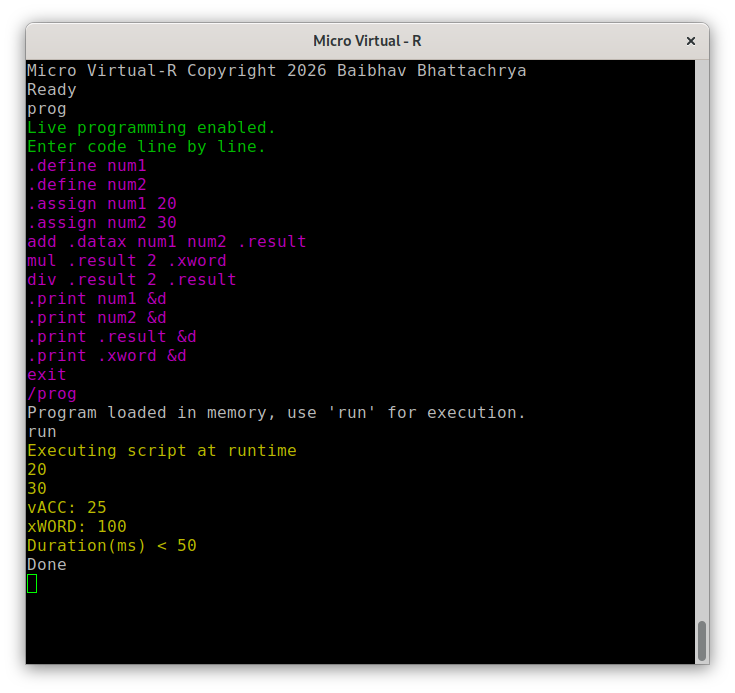

[
)](../../actions/workflows/build.yml)
# **Micro Virtual Runtime (&micro;VR AT89S52)**  
**Micro Virtual - R Copyright 2026 Baibhav Bhattacharya**  
**Micro Virtual - R** is a minimal runtime enviornment for Micro Controllers. This specific rendition of Micro Virtual - R is designed in compatibility with 8052 Class Microcontrollers MCS51 specifically AT89S52.
The entire runtime can fully function within the 256 byte internal ram of the AT89S52. It supports full Serial Communication. Command based audit. Fast paced industrial prototyping and a hands free programming approach. 

## **Micro Symbollic Script** 
 
The medium which powers &micro;VR AT89S52 is Micro Symbollic Script (&micro;SS)  
(&micro;SS) is a minituare DSL designed for Live programming in &microVR , it is heavily inspired from assembly in the aspect that it features no special symbols to represent operators, it is completely string based and follows a simple notation for seperation of keywords , built-in routines and flags.
 

## **Micro Symbollic Script on AT89S52**

## **Other Documentation & Links**

<a href="https://sites.google.com/view/micro-virtual-runtime-8052/
">Official Homepage</a>
 
<a href="https://sites.google.com/view/devblog-microvr8052/
">Development Blog</a>
 
<a href="https://github.com/BaibhavPenguin/micro-virtual-runtime-8052
">GitHub Repository</a>
 
<a href="https://github.com/BaibhavPenguin/micro-virtual-runtime-8052/release
">Releases</a>
 
<a href="https://sites.google.com/view/micro-virtual-runtime-8052/content/hardware-schematics
">Hardware Schematics & Drivers</a>

 

  
## **Credits**
Micro Virtual - R is completely designed and built by **Baibhav Bhattacharya** and is free and open source for anyone to use and modify! 
<a href="https://www.linkedin.com/in/baibhav-bhattacharya-214533402/"><strong>LinkedIn</strong></a>
 
<a href="https://github.com/BaibhavPenguin"><strong>GitHub Profile</strong></a>

