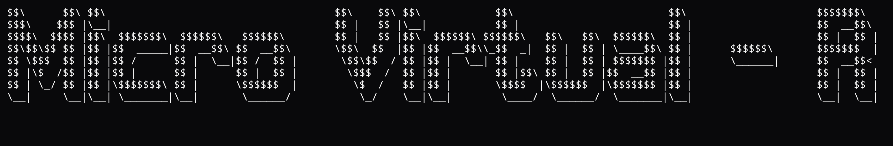
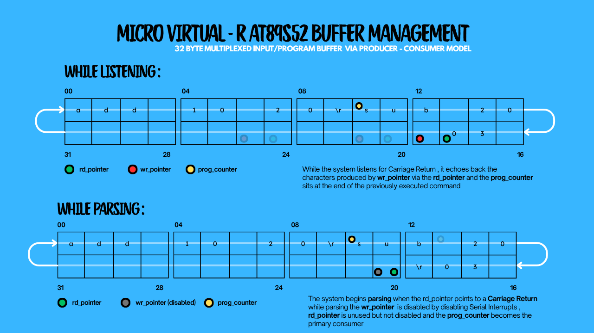
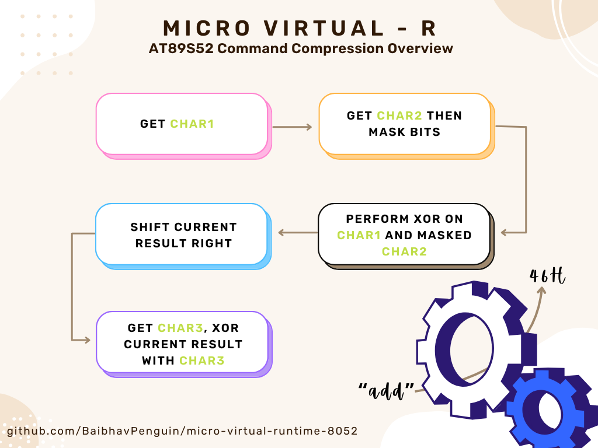

# **Micro Virtual Runtime (&micro;VR AT89S52)**  
**Micro Virtual - R Copyright 2026 Baibhav Bhattacharya** 

**Micro Virtual - R** is a minimal runtime enviornment for Micro Controllers. This specific rendition of Micro Virtual - R is designed in compatibility with 8052 Class Microcontrollers MCS51 specifically AT89S52.
The entire runtime can fully function within the 256 byte internal ram of the AT89S52. It supports full Serial Communication. Command based audit. Fast paced industrial prototyping and a hands free programming approach. 

## **The Vision of Micro Virtual - R** 
**A small program for blinking led's in C** 
`#include <reg52.h>

	void delay(unsigned char ms){
		unsigned char i , j;
		for(i = 0 ; i <= ms ; i++){
			for(j = 0 ; j <= 1275 ; j++){
				
			};
		};
	}

	void main(){
		while(1){
			P1.1 = 1
			delay(200);
			P1.1 = 0;
			delay(200);	
		}
	
	}

`
 
**Blinking LED via Micro virtual - R**
`tog p1 10 05 i 1` : toggle port 1 between 10 and 05 infinitely with a 1 second delay 
Micro Virtual - R significantly reduces the programming needed and eliminates the constant need of reflashing the rom for testing new logic.
 
## **The Memory Map of Micro virtual - R** 
 
  
 The Entire runtime fully functions inside of approximately 90 byte of ram. As any functional runtime
 can't only work on that, it uses the vast rom space of AT89S52 for maximum things possible.
 
## **The Software Architecture of Micro Virtual - R**  

 

 
## **Micro Virtual Runtime Interface**  
Micro virtual - R features a comprehensive CLI as a primary communication medium. It also supports font colors via `--c` command 
varivous arithmetic , logical and automation commands can be run via the serial terminal 

 
## **uVR Command Demo**  
**Some supported commands are** 
 
`add` : Add two numbers  
`sub` : Subtract two number  
`tog` : Toggle a Pin or Port 
`buf` : View previous Result 
`rld` : Load Virtual Accumulator (16-Bit) 

## **View Command List of Micro Virtual-R**

<a href="docs/Commands.md">View Command List - <u>Commands.md</u> </a>

 

## **Buffer Management in Micro Virtual - R**  

Micro Virtual - R uses a 32 byte Multiplexed input/program buffer. The entire buffer is located at 40H-5FH.  
The data is stored in a circular manner in which, if the buffer is completely filled the oldest data is overwritten with the latest input.  
The runtime uses a **Producer-Consumer Model** There are two system wide consumers for each state respectively. In the **Listener** state the *wr_pointer* acts as the producer
while *rd_pointer* acts as the primary consumer, in this stage *prog-counter* is either at the start of the buffer or at the end of the previous which also may be the start of the new command
 
In **Execution State** the producer i.e. *wr_pointer* is disabled to prevent noise and data corruption. *rd_pointer* is largely unused and *prog_counter* becomes the primary consumer which uses the data
generated previously by *rd_pointer* for parsing commands and parsing operands via *parser helper routines* inside the command handlers if primary command parsing results in a valid command
 
If the system enters an is_error state , it clears the input/program buffer and resets *rd_pointer* , *wr_pointer* and *prog-counter* to thet start of the buffer 

## **Command Compression and parsing in Micro Virtual - R**  

 
The commands are parsed and compressed via a custom hash function which only requires two pre-mapped temp variables for compression of a three letter opcode to a single byte command. 
**Yes!** using a hashing function means that collisions are inevitable especially when the bits of `char2` are also masked by `0x3f` to give a totlal of 64 possible combinations however, all the valid commands are 
perfect hashes of the algorithm and as this algorithm uses almost no stack for variables, it is a suitable choice for this specific use case.  
The Instructions are parsed , compressed and placed in the Instruction Buffer for further execution.  
## **Credits**
Micro Virtual - R is completely designed and built by **Baibhav Bhattacharya** and is free and open source for anyone to use and modify! 
**LinkedIn** https://www.linkedin.com/in/baibhav-bhattacharya-214533402/  
**BaibhavPenguin** on GitHub  
## **Official Repository**  
https://github.com/BaibhavPenguin/micro-virtual-runtime-8052
