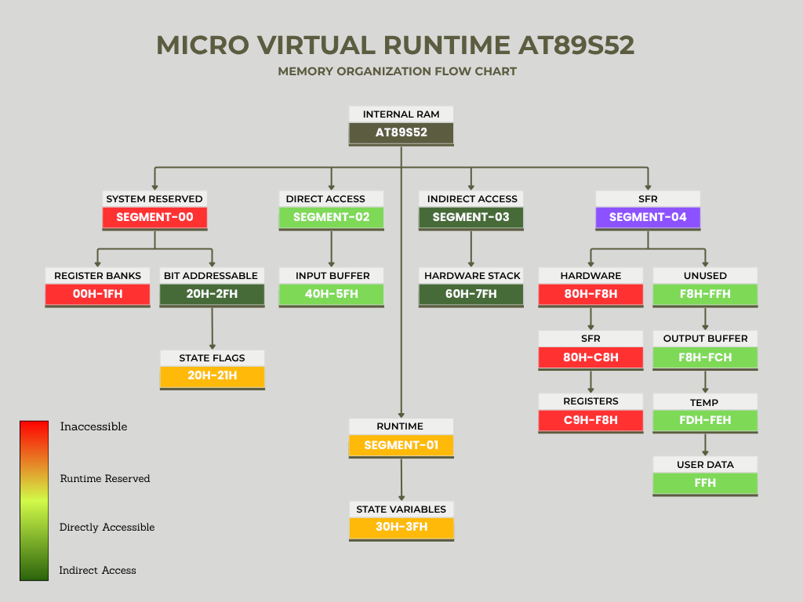
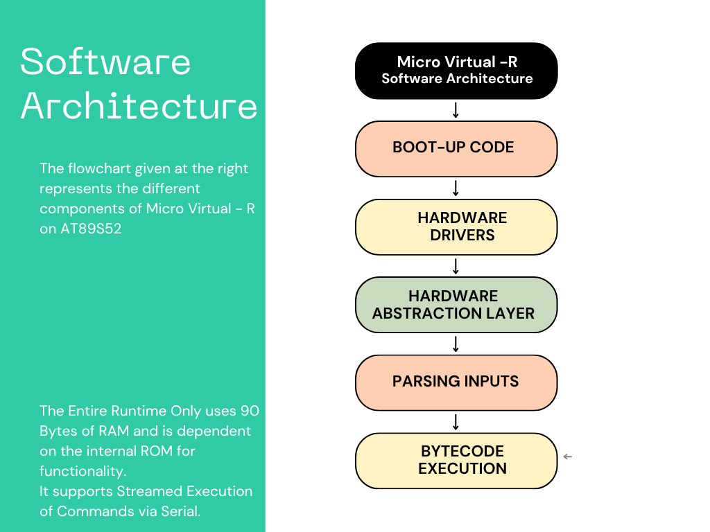
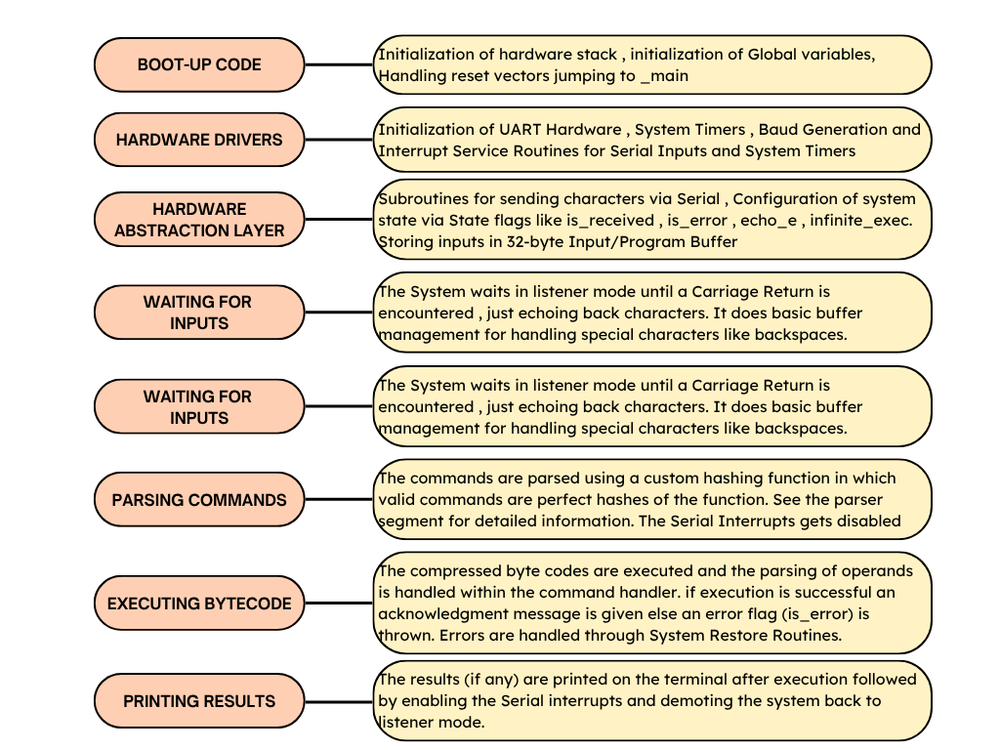
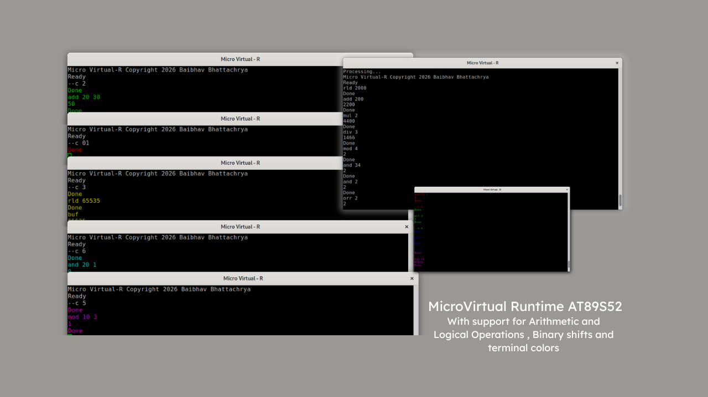

# **Micro Virtual Runtime (uVR AT89S52)**  
**Micro Virtual - R Copyright 2026 Baibhav Bhattacharya**  
Micro Virtual - R is a minimal runtime enviornment for Micro Controllers. This specific rendition of Micro Virtual - R is designed in compatibility with 8052 Class Microcontrollers MMCS51 specifically AT89S52.
The entire runtime can fully function within the 256 byte internal ram of the AT89S52. It supprots full Serial Communication. Command based audit. Fast paced industrial prototyping and a hands free programming approach. 

## **The Vision of Micro Virtual - R** 
**A small program for blinking led's in C** 
`#include <reg52.h>

	void delay(unsigned char ms){
		unsigned char i , j;
		for(i = 0 ; i <= ms ; i++){
			for(j = 0 ; j <= 1275 ; j++){
				
			};
		};
	}

	void main(){
		while(1){
			P1.1 = 1
			delay(200);
			P1.1 = 0;
			delay(200);	
		}
	
	}

`
 
**Blinking LED via Micro virtual - R**
`tog p1 10 05 i 1` : toggle port 1 between 10 and 05 infinitely with a 1 second delay 
Micro Virtual - R significantly reduces the programming needed and eliminates the constant need of reflashing the rom for testing new logic.
 
## **The Memory Map of Micro virtual - R** 
 
  
 The Entire runtime fully functions inside of approximately 90 byte of ram. As any functional runtime
 can't only work on that, it uses the vast rom space of AT89S52 for maximum things possible.
 
## **The Software Architecture of Micro Virtual - R**

 

 
## **Micro virtual Runtime Interface**  
Micro virtual - R features a comprehensive CLI as a primary communication medium. It also supports font colors via `--c` command 
varivous arithmetic , logical and automation commands can be run via the serial terminal 

 
## **uVR Command Demo**  
**Some supported commands are : ** 
`add` : Add two numbers  
`sub` : Subtract two number  
`tog` : Toggle a Pin or Port 
`buf` : View previous Result 
`rld` : Load Virtual Accumulator (16-Bit) 
*and many more!* check **tree/main/docs/Commands.md** for detailed information on supported commands and their usage! 
## **Credits**
Micro Virtual - R is completely designed and built by **Baibhav Bhattacharya** and is free and open source for anyone to use and modify! 
**LinkedIn** https://www.linkedin.com/in/baibhav-bhattacharya-214533402/  
**BaibhavPenguin** on GitHub  
## **Official Repository**  
https://github.com/BaibhavPenguin/micro-virtual-runtime-8052
